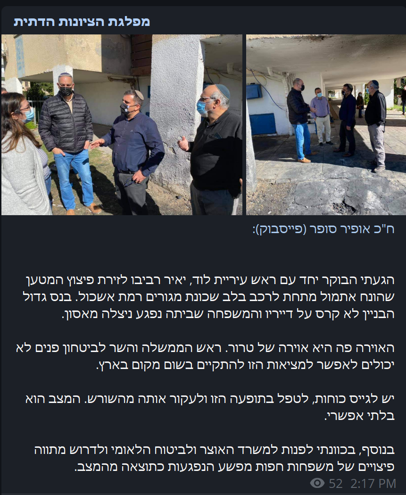

# בית

זה Iris - בוט עדכוני הרשתות-החברתיות האוטומטי!

Iris מאפשר לכם לעקוב אחר משתמשים בפלטפורמות שונות ולקבל את העדכונים שלהם!

## פלטפורמות נתמכות
 - פייסבוק
 - טוויטר

## דוגמאות

Iris מסוגל לשלוח סוגים שונים של עדכונים עם מראה חלק וטבעי!
הנה כמה דוגמאות:

<figure>
  
  <figcaption>עדכוני טקסט</figcaption>
</figure>

<figure>
  
  <figcaption>עדכונים עם אלבומי תמונות</figcaption>
</figure>

<figure>
  
  <figcaption>עדכונים עם סרטון</figcaption>
</figure>

<figure>
  
  <figcaption>עדכוני שידור חי</figcaption>
</figure>